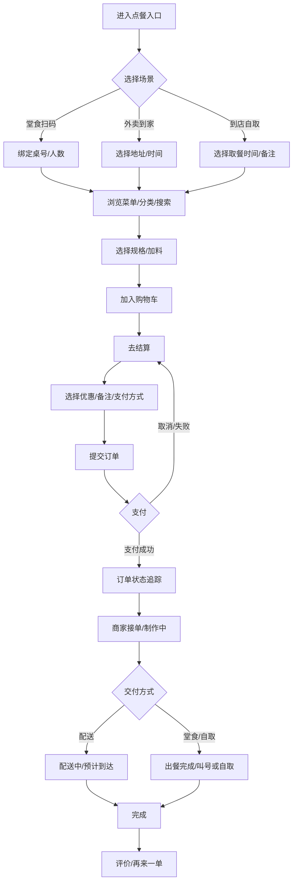

# 国内小型点餐系统竞品与最小可交付前端 Demo 功能需求调研报告

## 执行摘要

国内点餐产品在形态上主要分为两条路线：面向消费者的**平台型点餐（外卖/到店自取）**，以及面向商家的**门店型点餐（堂食扫码点餐/收银点餐/自助点餐/聚合外卖）**。平台型代表是美团外卖与饿了么（近期品牌侧出现“淘宝闪购”相关升级/更名信号）；门店型代表包括支付宝“扫码点餐”解决方案与餐饮 SaaS（美团餐饮系统、客如云、二维火、银豹、哗啦啦等）。这些竞品共同收敛到同一组“可交付核心”：**菜单（分类/搜索）→ 规格加料 → 购物车 → 优惠 → 提交订单 → 支付 → 订单状态（出餐/配送/取餐）**，商家侧则围绕**接单/出餐/状态流转、菜品与库存、对账数据、营销会员**展开。 citeturn1search0turn0search2turn3search0turn4search0turn1search3

基于竞品共性与小型项目“前端最小可交付”的目标，本报告建议把 Demo 收敛为 **5 页（用户 4 页 + 商家 1 页）**：**入店/方式选择（扫码/外卖/自取）**、**菜单+购物车**、**结算/支付选择**、**订单详情/状态追踪**、**商家接单与出餐看板**。这 5 页覆盖外卖与堂食扫码点餐的共同骨架，且能用 Mock API 完成端到端演示闭环（下单→支付→状态变化→完成→评价入口）。 citeturn9search3turn1search3turn4search0

---

## 研究范围与方法

本次调研以“国内小型点餐系统”视角，选取能代表主流交互与功能集合的竞品来源，优先使用官方/应用商店/开放平台文档：  
1) **平台型外卖（用户端）**：美团外卖 iOS/安卓商店页（功能与活动、支付等），饿了么 iOS App Store 页（含“预约订餐、订单状态通知、排序筛选、优惠活动、照片点评”等描述）。citeturn1search0turn6search1turn0search2  
2) **平台型外卖（商家端）**：美团外卖商家版 App Store/应用宝页（接单、退款、对账、门店与库存等），饿了么商家端在应用宝侧显示“淘宝闪购商家版”升级信息（订单、消息、管理、经营建议、打印机设置等）。citeturn0search5turn0search1turn11search1  
3) **开放平台/对接视角**：美团技术服务合作中心外卖业务流程与订单详情接口（字段、状态、预计到达、骑手坐标、优惠明细等），以及配送状态回调（状态码、回调响应时限、重试机制等）；饿了么/“淘宝闪购服务商平台”开放平台 PDF/页面（支持店铺/商品/订单/配送等接口与接入流程）。citeturn9search3turn9search0turn9search1turn10search0turn10search2turn11search2  
4) **堂食扫码点餐/门店型解决方案**：支付宝文档中心“扫码点餐”介绍与“扫码点菜”支付接入要点（创建交易+JSAPI 唤起收银台），以及阿里本地通（原口碑掌柜）应用商店说明（商家平台，打通高德/支付宝/淘宝/饿了么/口碑等）。citeturn1search3turn3search3turn2search0  
5) **餐饮 SaaS（小店常见）**：美团餐饮系统官网能力点（外卖自动接单、会员营销、手机点餐等）；客如云能力点（多样化点餐场景、聚合外卖、聚合支付、后厨联动/叫号等）；二维火官网（扫码点餐/支付、会员营销等）；银豹点餐小程序（堂食/外带/扫码点单、会员注册/充值）；哗啦啦 POS 产品页（断网离线点餐/结账/厨房出单等要素）。citeturn3search0turn4search0turn4search1turn5search2turn5search1  
6) **历史竞品资料**：百度外卖并入饿了么的权威新闻来源（央视网、新华社《经济参考网》）。citeturn2search2turn2search5

说明：不同城市、品类与版本迭代会导致细节差异，本报告重点抽取**“稳定的共性流程与 UI 结构”**，并把“可能变化/依赖生态能力”的部分标注为次要或可选。

---

## 竞品对照表与差异化要点

下表用“核心能力打勾”的方式，将竞品按场景归类，并抽取对小型点餐系统最有参考价值的功能簇。勾选表示“在其典型形态中明确存在/强相关”（以公开描述与官方文档为依据）。

| 竞品 | 场景 | 菜单/分类/搜索 | 规格/加料 | 购物车/结算 | 优惠/满减/红包 | 桌号/扫码入店 | 订单状态/追踪 | 配送/预计到达/骑手 | 评价/晒单 | 商家接单/出餐 | 菜品/库存管理 | 对账/数据 | 独特亮点（与痛点） | 链接 |
|---|---|---|---|---|---|---|---|---|---|---|---|---|---|---|
| 美团外卖（用户端） | 外卖/到家 + 即时零售 | ✓ | ✓（常见） | ✓ | ✓ | — | ✓（订单流程/状态） | ✓（配送链路、预计到达） | ✓（常见） | — | — | — | 价格与活动入口密集，强调在线支付与平台补贴；与商家/配送侧过程强绑定（预计到达、配送方式等字段在对接文档中体现）。citeturn1search0turn9search0turn9search3 | citeturn1search0 |
| 饿了么（用户端） | 外卖/到家 + 到店自取 | ✓ | ✓（常见） | ✓ | ✓ | — | ✓（状态通知） | ✓（状态通知、准时达） | ✓（照片点评） | — | — | — | 描述中明确“预约订餐、及时通知外卖状态、排序筛选、优惠、照片点评”。citeturn0search2 | citeturn0search2 |
| 百度外卖（历史） | 外卖（已并入） | ✓（历史形态） | ✓ | ✓ | ✓ | — | ✓ | ✓ | ✓ | — | — | — | 2017 年并入饿了么：合并完成后成为饿了么全资子公司（历史参考，现不建议作为新系统 UI 的直接对标对象）。citeturn2search2turn2search5 | citeturn2search2 |
| 美团外卖商家版 | 商家端（外卖） | — | — | — | ✓（活动相关） | — | ✓（处理催单/退单） | ✓（配送信息配置） | ✓（可看评价图） | ✓ | ✓（库存等） | ✓（结算对账） | 以“接单-催单-退单/退款-对账结算-门店营业/库存”为核心。citeturn0search1turn0search5 | citeturn0search5 |
| 淘宝闪购商家版（原饿了么商家版升级） | 商家端（外卖/即时零售） | — | — | — | ✓（活动配置） | — | ✓（订单聚合） | ✓（配送相关） | ✓（顾客评价） | ✓ | ✓（商品管理/门店装修） | ✓（数据中心/经营建议） | 应用宝页面明确“原饿了么商家版全新升级为淘宝闪购商家版”，并列出订单/消息/管理/经营模块与打印机/营业设置等。citeturn11search1turn10search2 | citeturn11search1 |
| 支付宝“扫码点餐/扫码点菜”（口碑生态相关） | 堂食扫码点餐 | ✓ | ✓ | ✓ | ✓（可接券/会员） | ✓ | ✓（堂食订单状态常见） | —（堂食通常无骑手） | —/✓（可扩展） | ✓（门店侧） | ✓（门店侧） | ✓（门店侧） | 文档强调“支持全场景扫码点餐”，并给出支付接入要点：创建交易+JSAPI 唤起收银台。citeturn1search3turn3search3 | citeturn1search3 |
| 阿里本地通（原口碑掌柜） | 商家端（本地生活多业态） | — | — | — | ✓ | ✓（口碑/支付宝场景） | ✓（订单处理） | ✓（对接多平台） | — | ✓ | ✓ | ✓ | App Store 描述强调“一点接入，多端通达”，接入高德/支付宝/淘宝/饿了么/口碑等流量平台。citeturn2search0 | citeturn2search0 |
| 美团餐饮系统（RMS） | 门店餐饮 SaaS（收银/点餐/外卖对接） | ✓ | ✓ | ✓ | ✓（会员营销等） | ✓（手机点餐/扫码相关） | ✓ | ✓（外卖对接） | —/✓ | ✓（外卖自动接单等） | ✓ | ✓ | 官网直接列出“外卖自动接单、会员营销、手机点餐”等能力；适合作为“小店一体化”参考。citeturn3search0turn5search3 | citeturn3search0 |
| 客如云（餐饮 SaaS） | 门店餐饮 SaaS（前厅+后厨+总部） | ✓ | ✓ | ✓ | ✓（营销/会员） | ✓（小程序点餐等） | ✓（订单联动） | ✓（聚合外卖/配送） | —/✓ | ✓ | ✓ | ✓ | 强项是“多样化点餐场景（服务员/平板/小程序）、聚合外卖自动接单打印、后厨联动、叫号通知”。citeturn4search0 | citeturn4search0 |
| 二维火 | 门店餐饮 SaaS | ✓ | ✓ | ✓ | ✓（会员营销互动） | ✓（扫码点餐/支付） | ✓ | ✓（O2O 融合） | —/✓ | ✓ | ✓ | ✓ | 官网明确强调“扫码点餐/支付、手机管理店铺、会员营销互动”等。citeturn4search1 | citeturn4search1 |
| 银豹点餐小程序 | 小店低门槛点餐 | ✓ | ✓ | ✓ | ✓（会员侧） | ✓（扫码点单） | ✓ | —/✓（外带/到店） | — | ✓（门店侧） | ✓ | ✓ | 官方页面强调“低门槛、快部署、易操作”，并支持堂食/外带/扫码点单、会员注册与充值。citeturn5search2 | citeturn5search2 |
| 哗啦啦 POS（示例） | 门店收银/点餐（中大型偏多） | ✓ | ✓ | ✓ | ✓ | ✓ | ✓ | ✓（聚合外卖） | —/✓ | ✓ | ✓ | ✓ | 明确强调“断网离线点餐/结账/厨房出单”，这类能力对门店场景是差异点，但 Demo 可先弱化为“离线提示/草稿”。citeturn5search1 | citeturn5search1 |

差异化结论（用于指导 Demo 取舍）：  
平台型（美团/饿了么）真正壁垒在**履约网络、补贴/券体系、实时配送与风控**；小型自建点餐系统的 Demo 不需要复制这些壁垒，但必须在 UI 上提供“用户心智锚点”（订单状态可视化、预计时间、优惠入口、规格加料的一致性）。美团开放文档在订单字段与配送状态回调中，把“预计到达、配送状态、骑手信息、优惠明细”等关键要素结构化了，适合直接作为 Demo 的数据模型参考。citeturn9search0turn9search1turn9search3

---

## 核心流程与交互要素提炼

### 用户侧主流程

外卖/到家主流程可以抽象为：选店选品 → 购物车 → 确认地址与时间 → 优惠与备注 → 支付 → 状态追踪 → 完成。美团外卖业务流程在对接文档中明确包含“下单菜品、送货地址、送货时间”，商家接单出餐并安排配送，配送方式也可区分商家自配/众包/平台专送；订单数据接口包含支付状态、订单状态、预计到达时间、配送员坐标等字段，这些都对应到前端的“订单确认页”和“订单详情追踪页”的 UI 需求。citeturn9search3turn9search0

饿了么用户端的公开描述中，直接点出了两个对前端 Demo 很关键的交互锚点：**预约订餐（时间选择）**与**及时通知外卖状态（状态推送/轮询）**，以及“智能筛选排序餐厅”“各种满减打折活动”“外卖美食照片点评”等典型功能模块。citeturn0search2

堂食扫码点餐主流程通常是：扫码入店/桌号绑定 → 浏览菜单与加料 → 下单 → 支付（或先下单后结账）→ 出餐/上菜/叫号 → 完成。支付宝“扫码点餐”文档强调其“支持全场景扫码点餐”，并从商家视角强调“提高翻台率、顾客扫码支付秒到账、可接入券营销或会员卡营销”。对 Demo 来说，这意味着二维码/桌号绑定、支付入口、优惠/会员入口是堂食场景最直观的“必要件”。citeturn1search3

### 商家侧主流程

商家端的共性流程是：新订单提醒 → 接单/拒单 → 出餐中 → 完成/交付（堂食叫号/自取取餐/外卖交给骑手）→ 对账/评价处理。美团外卖商家版与其应用商店介绍聚焦“订单管理（接单、催单、退单/退款）、账户结算对账、门店营业信息与库存调整”等；“淘宝闪购商家版（原饿了么商家版升级）”则把功能组织为订单/消息/管理/经营/我的（含打印机与营业设置）等模块。citeturn0search1turn0search5turn11search1

如果你的 Demo 希望体现“更像真实系统”，可以借鉴开放平台的**状态流转**：例如美团配送状态回调给出了物流状态码（确认、到店、取货、送达、取消等），并要求商家系统在 2 秒内响应回调，否则会判定推送失败并重试，这反向提示前端：订单详情页最好同时承载“状态时间线/脚印”，并能在状态变化时给用户明确反馈。citeturn9search1

### 关键交互要素清单

扫码/二维码：堂食扫码点餐的入口级交互。支付宝方案的核心就是基于扫码进入点餐流程并完成支付。citeturn1search3turn3search3  
地图与预计时间：外卖场景的“信任锚点”。美团订单数据模型提供预计到达时间、骑手经纬度等字段，能够支撑“地图预览 + ETA”。citeturn9search0turn9search1  
时间选择：预约订餐在饿了么公开描述中被列为特色功能之一，美团业务流程也包含“送货时间”。citeturn0search2turn9search3  
地址管理：外卖必备；在美团订单详情字段中体现为收货人地址/经纬度。citeturn9search0  
优惠券/满减：平台型与门店型都高度依赖优惠入口；饿了么描述明确“各种满减打折活动”，美团订单数据也存在优惠信息结构。citeturn0search2turn9search0  
通知/订单状态：饿了么明确强调“及时通知外卖状态”，美团配送回调机制则提示“状态变更”是稳定存在的系统事件。citeturn0search2turn9search1

---

## 核心功能清单与优先级

这里把功能拆成“用户端/商家端”两组，并用 **必备 / 次要 / 可选** 标注优先级。判定原则：能否支撑“最小可交付 Demo 的闭环演示”，以及是否是竞品中高频出现的“入口级模块”。

### 用户端功能清单

必备：菜单浏览（分类/搜索）是所有形态点餐的起点；购物车与结算是下单闭环；优惠入口与支付选择是国内产品默认心智；订单状态页是“下单成功之后用户最关心的事”。这些在饿了么特色功能、美团订单字段与业务流程中都有明确映射。citeturn0search2turn9search0turn9search3

| 功能模块 | 必备 | 次要 | 可选 | 说明（为什么） |
|---|:---:|:---:|:---:|---|
| 门店/就餐方式入口（堂食扫码/外卖/自取） | ✓ |  |  | 堂食扫码点餐方案强调“全场景扫码点餐”，外卖业务流程强调地址/时间，入口要能分流。citeturn1search3turn9search3 |
| 菜单分类 + 列表 | ✓ |  |  | 门店型 SaaS 普遍强调“高效点餐、多场景点餐”，需要稳定的菜单浏览结构。citeturn4search0turn4search1turn3search0 |
| 搜索/筛选 |  | ✓ |  | 饿了么公开描述把“智能筛选排序餐厅”列为特色；Demo 可简化为“菜品搜索”。citeturn0search2 |
| 规格/加料/口味选择 | ✓ |  |  | 平台与门店点餐都高频，且直接影响购物车数据结构；美团订单菜品明细字段中包括 spec/attrValues 等可借鉴。citeturn9search0 |
| 购物车（加减、清空、凑起送/起步价提示） | ✓ |  |  | 是下单闭环关键；与“满减/优惠”强相关。citeturn0search2turn9search0 |
| 优惠（优惠券/满减/红包） | ✓ |  |  | 饿了么强调满减折扣，美团订单结构含优惠列表；Demo 至少要能“选择一张券并影响应付金额”。citeturn0search2turn9search0 |
| 地址管理（外卖） |  | ✓ |  | 外卖业务流程/订单字段强依赖地址；Demo 可做 1-2 条地址的选择与新增。citeturn9search0turn9search3 |
| 桌号/人数（堂食扫码） |  | ✓ |  | 支付宝扫码点餐是强入口；Demo 可用“桌号绑定”替代真实扫码。citeturn1search3 |
| 时间选择（立即送出/预约） |  | ✓ |  | 饿了么明确提“预约订餐”；美团流程提“送货时间”。citeturn0search2turn9search3 |
| 支付方式选择（线上/到店/货到付款） | ✓ |  |  | 支付是闭环终点；支付宝“扫码点菜”文档明确了“创建交易+JSAPI 唤起收银台”的典型模式。citeturn3search3 |
| 订单详情/状态追踪（时间线、预计到达、地图预览） | ✓ |  |  | 美团订单字段含 estimate_arrival_time，配送回调含物流状态；饿了么强调状态通知。citeturn9search0turn9search1turn0search2 |
| 评价/晒单 |  | ✓ |  | 饿了么明确“外卖美食照片点评”；Demo 可做“评价入口 + 提交评价（Mock）”。citeturn0search2 |
| 登录/会员（手机号、积分） |  |  | ✓ | 门店 SaaS 常配会员营销；Demo 可用“免登录+游客”替代，或做极简手机号校验。citeturn4search1turn5search2turn4search0 |
| 推送/通知（App Push） |  |  | ✓ | Demo 可用轮询/定时器模拟“状态变化”，不必实现真实推送；但可以在文案上体现“订单状态通知”。citeturn0search2turn9search1 |

### 商家端功能清单

商家端“最小可演示”的必备项通常只需要：**接单/拒单、改状态（出餐中/已完成）、查看订单详情**。因为即便是美团/饿了么商家端，核心也围绕订单处理与门店运营设置展开。citeturn0search1turn0search5turn11search1

| 功能模块 | 必备 | 次要 | 可选 | 说明（为什么） |
|---|:---:|:---:|:---:|---|
| 新订单列表（待接单/进行中/已完成） | ✓ |  |  | 竞品商家端都把订单聚合为第一入口。citeturn0search1turn11search1 |
| 接单/拒单、催单备注、预订单提示 | ✓ |  |  | 美团商家版明确包含“接单、处理催单”；“淘宝闪购商家版”描述同样以订单事务为核心。citeturn0search1turn11search1 |
| 出餐状态流转（制作中/已出餐/已完成） | ✓ |  |  | 与用户端“订单追踪”强耦合；可借鉴开放平台的状态事件思路。citeturn9search1 |
| 菜品管理/估清（上架、库存） |  | ✓ |  | 美团商家版描述中强调库存与门店信息调整；但 Demo 可先不给 UI，只保留接口占位。citeturn0search1 |
| 对账/数据中心 |  |  | ✓ | 真正产品重要，但 Demo 不做也能闭环；竞品中是强化模块。citeturn0search1turn11search1 |
| 打印机/小票（设置页） |  |  | ✓ | “淘宝闪购商家版”描述包含打印机设置；Demo 可仅做“打印按钮/提示”。citeturn11search1 |

---

## 最小前端 Demo 页面清单与可实现规格

### Demo 目标与范围约束

目标：用 **Mock API** 在浏览器里完整演示一次“点餐到完成”的闭环，并能切换“堂食扫码/外卖”两种模式（通过入口分流 + 结算字段差异实现），不要求真实支付/地图 SDK/推送。  
范围约束：  
- 必做：菜单+规格+购物车+结算+下单+订单追踪+商家接单/改状态。  
- 不做或仅占位：真实支付通道、真实地图轨迹、复杂营销规则（阶梯满减/叠券）、复杂会员体系。  
这些取舍能覆盖竞品的“高频交互骨架”，同时避免把 Demo 做成“平台级工程”。citeturn0search2turn9search0turn1search3turn4search0

下面给出建议的 **5 页**（符合你要求的 4–6 页范围），并为每页提供：交互要点、示例数据、关键 API/前端事件、验收标准。

### 页面与交互规格

#### 入店与方式选择页

页面目标：建立订单上下文（storeId + mode + tableNo/address）。  
交互要点：  
- 入口提供两种进入方式：  
  - “堂食扫码点餐”：输入/选择桌号（模拟扫码结果），可选人数；与支付宝扫码点餐心智一致。citeturn1search3  
  - “外卖到家”：选择/新增地址；对应外卖业务流程与订单字段。citeturn9search3turn9search0  
- 一键进入“菜单页”。  
- 若不填桌号/地址，给出阻断提示（最小风控）。

示例数据（前端常量或 Mock API 返回）：
```json
{
  "store": {"id":"s_1001","name":"小李川菜馆","minOrderAmount":20,"deliveryFee":3},
  "modes": ["DINE_IN","DELIVERY","PICKUP"],
  "tables": ["A01","A02","B10"],
  "addresses": [
    {"id":"addr_1","name":"张三","phone":"13800000000","detail":"XX路88号3单元1202","lng":116.487451,"lat":40.008269}
  ]
}
```

关键前端事件（建议埋点/状态管理事件名）：  
- `entry_mode_selected`（payload: mode）  
- `table_bound`（payload: tableNo, partySize）  
- `address_selected` / `address_created`  

Mock API（最少 2 个）：  
- `GET /api/stores/:storeId`  
- `GET /api/users/me/addresses`（可选）

验收标准：  
- 选择堂食：必须绑定桌号才能进入菜单；选择外卖：必须选择地址才能进入菜单。  
- 刷新页面后，入口选择可从 localStorage 恢复（提升“像真实 App”的体验）。

#### 菜单页

页面目标：完成“浏览→选择规格→加购→查看购物车”的核心循环。  
竞品映射：平台与门店型 SaaS 都把“点餐效率”放在首位；客如云强调多样化点餐场景与前后厨联动，美团餐饮系统强调手机点餐；这些都要求菜单页结构清晰、加购操作足够短路径。citeturn4search0turn3search0

交互要点：  
- 左侧/顶部分类 + 右侧列表（或顶部 Tab + 列表），支持“吸顶分类”。  
- 每个菜品卡片：图、名、月售/推荐（可选）、价格、`+` 按钮。  
- 点击菜品：打开规格弹窗（单选规格 + 多选加料 + 备注），确认后加入购物车。  
- 底部购物车浮条：显示件数与小计，点击展开购物车抽屉（加减/删）。  
- 搜索框（次要）：支持按菜名过滤。

示例数据（菜单模型建议直接对齐“SKU + attrValues”的结构，便于做规格/加料）：  
```json
{
  "categories":[
    {"id":"c_1","name":"招牌"},
    {"id":"c_2","name":"川味热菜"},
    {"id":"c_3","name":"饮品"}
  ],
  "items":[
    {
      "id":"p_101","categoryId":"c_2","name":"宫保鸡丁",
      "image":"https://example.com/img/gongbao.jpg",
      "basePrice":28,
      "specs":[{"id":"s1","name":"小份","delta":0},{"id":"s2","name":"大份","delta":8}],
      "addons":[{"id":"a1","name":"加花生","delta":2},{"id":"a2","name":"加米饭","delta":3}],
      "tags":["辣","下饭"]
    }
  ]
}
```

关键前端事件：  
- `menu_category_viewed`（categoryId）  
- `product_detail_opened`（productId）  
- `sku_added_to_cart`（productId, specId, addonIds, qty, price）  
- `cart_item_qty_changed`（cartItemId, delta）  
- `cart_opened`  

Mock API（最少 2 个）：  
- `GET /api/stores/:storeId/menu`  
- `POST /api/cart/validate`（可选：校验起送价/库存/估清，Demo 可仅返回通过）

验收标准：  
- 菜品可按分类浏览；至少 1 个菜品支持“规格+加料”；购物车加减能正确更新金额。  
- “去结算”按钮在购物车为空时禁用；达到起送价（若设置）后可点。

#### 结算页

页面目标：把“购物车”变成“订单”，并体现国内点餐最常见的确认项：优惠、地址/桌号、时间、备注、支付方式。  
竞品映射：饿了么强调“预约订餐”“优惠不断”“状态通知”，美团外卖流程强调地址与送达时间；支付宝扫码点菜强调支付链路（创建交易+JSAPI 唤起收银台）。citeturn0search2turn9search3turn3search3

交互要点：  
- 顶部展示门店信息与模式（堂食/外卖/自取）。  
- 信息区块：  
  - 外卖：地址、联系电话、送达时间（立即/预约）  
  - 堂食：桌号、人数（可选）  
- 优惠券选择：弹层列出可用券（选 1 张），实时更新应付金额。  
- 订单备注：输入框（过敏/不放辣等）。  
- 支付方式：至少 2 个选项（在线支付 / 到店支付 / 货到付款），根据模式控制可用性。  
- 提交订单：点击后进入“创建订单” loading，再跳转订单详情页。

示例数据（优惠券最小模型）：  
```json
{
  "coupons":[
    {"id":"cp_10","title":"满30减10","threshold":30,"discount":10,"scope":"STORE"},
    {"id":"cp_5","title":"无门槛减5","threshold":0,"discount":5,"scope":"STORE"}
  ],
  "paymentMethods":[
    {"id":"ONLINE","name":"在线支付"},
    {"id":"COD","name":"货到付款"},
    {"id":"PAY_AT_STORE","name":"到店支付"}
  ]
}
```

关键前端事件：  
- `checkout_viewed`  
- `coupon_sheet_opened` / `coupon_applied`（couponId）  
- `delivery_time_selected`（type: ASAP/SCHEDULED, time）  
- `payment_method_selected`（methodId）  
- `order_submitted`（orderId）

Mock API（最少 3 个）：  
- `POST /api/orders`（创建订单）  
- `POST /api/payments/create`（创建支付单，Demo 返回 mock payUrl 或 payToken）  
- `POST /api/payments/confirm`（模拟支付成功）

验收标准：  
- 选择优惠券后，应付金额正确变化（且不低于 0）。  
- 订单创建成功后跳转订单详情页，页面能展示订单号、金额、模式、关键字段（地址/桌号）。  
- 支付模拟成功后，订单状态从 `PENDING_PAYMENT` 变为 `PAID`。

#### 订单详情/状态追踪页

页面目标：让用户“放心”，并把状态变化可视化（时间线/预计时间/地图占位）。  
竞品映射：饿了么强调“及时通知外卖状态”；美团订单数据包含订单状态、支付状态、预计到达时间、骑手坐标、优惠明细；美团配送回调给出配送状态码与状态变更时间的结构化信息。citeturn0search2turn9search0turn9search1

交互要点：  
- 订单状态头部：  
  - `待支付` / `已支付` / `商家已接单` / `制作中` / `配送中/待取餐` / `已完成` / `已取消`  
- 状态时间线（订单脚印）：每次状态变化追加一条（带时间）。  
- 预计时间展示：若外卖模式，显示 ETA；字段可对齐 `estimate_arrival_time`。citeturn9search0  
- 地图区域：  
  - Demo 版用静态图/占位组件（MapPlaceholder），显示“骑手坐标/距离/预计到达”，无需接入真实地图 SDK。  
- 操作区：  
  - “再来一单”（可选）  
  - “评价”（次要：完成后可用）  
  - “取消订单”（仅待接单/待支付可用，Demo 可简化规则）

示例数据（订单与状态模型，建议与美团字段做映射，便于后续扩展）：  
```json
{
  "order":{
    "id":"o_90001",
    "storeId":"s_1001",
    "mode":"DELIVERY",
    "payStatus":"PAID",
    "orderStatus":"ACCEPTED",
    "estimateArrivalTime": 1764505086,
    "courier":{"name":"李师傅","phoneMask":"138****1234","lng":116.487,"lat":40.008},
    "discounts":[{"name":"满30减10","amount":10}],
    "items":[{"name":"宫保鸡丁(大份)","qty":1,"price":36}]
  },
  "timeline":[
    {"code":"CREATED","text":"订单已提交","ts":1764502086},
    {"code":"PAID","text":"支付成功","ts":1764502098},
    {"code":"ACCEPTED","text":"商家已接单","ts":1764502200}
  ]
}
```

关键前端事件：  
- `order_detail_viewed`（orderId）  
- `order_status_polled`（orderId, status）  
- `order_cancel_clicked` / `order_cancel_confirmed`  
- `review_entry_clicked`

Mock API（最少 2 个）：  
- `GET /api/orders/:orderId`  
- `GET /api/orders/:orderId/timeline`（或合并在订单详情内）  
- 状态更新方式：前端每 3–5 秒轮询一次（Demo），或用 SSE/WebSocket（可选）。

验收标准：  
- 下单后能在订单详情中看到商品列表、金额、优惠、模式字段。  
- 模拟“商家接单/出餐/完成”后，用户端状态时间线会更新（轮询或事件触发）。  
- 外卖模式显示 ETA 与地图占位；堂食模式显示桌号与“取餐/上菜状态占位”。

#### 商家订单看板页

页面目标：用一个页面实现“接单→出餐→完成”的演示闭环，让用户端状态变化有来源。  
竞品映射：美团外卖商家版强调接单、催单、退单/退款与门店/库存；“淘宝闪购商家版”把订单聚合、消息与管理作为主模块。citeturn0search1turn11search1

交互要点：  
- Tab：`新订单`、`制作中`、`已完成`。  
- 新订单卡片：订单号、下单时间、模式、商品摘要、备注、应付金额。  
- 操作按钮：`接单` / `拒单`（拒单可选原因），接单后进入制作中。  
- 制作中卡片：`出餐完成/可取餐` 或 `呼叫骑手/开始配送`（根据模式）。  
- 完成卡片：只读。

示例数据：直接复用订单模型，商家侧多显示“备注/联系方式/地址/桌号”。

关键前端事件：  
- `merchant_order_list_viewed`  
- `merchant_accept_clicked`（orderId）  
- `merchant_status_changed`（orderId, nextStatus）

Mock API（最少 3 个）：  
- `GET /api/merchant/orders?status=NEW|PREPARING|DONE`  
- `POST /api/merchant/orders/:orderId/accept`  
- `POST /api/merchant/orders/:orderId/status`（body: nextStatus）

验收标准：  
- 商家点击“接单”后，用户端订单状态在下一次轮询中从 `CREATED/PAID` 进入 `ACCEPTED/PREPARING`。  
- 商家点击“出餐完成/配送中/已完成”后，用户端时间线同步追加记录。

### Demo 级关键 API/事件总表

如果你希望接口更贴近国内平台生态，可直接借鉴开放文档的字段组织方式：美团订单详情接口示例包含 pay_status、status、estimate_arrival_time、收货地址经纬度、配送员坐标、优惠列表、菜品明细（含 spec/attrValues）等，非常适合作为“前端 Demo 假后端”的数据模型蓝本。citeturn9search0

最小建议 API 列表（可用 MSW / MirageJS / 本地 Node mock 实现）：  
- `GET /api/stores/:storeId`  
- `GET /api/stores/:storeId/menu`  
- `GET /api/users/me/addresses`  
- `POST /api/orders`  
- `GET /api/orders/:orderId`  
- `POST /api/payments/create`、`POST /api/payments/confirm`  
- `GET /api/merchant/orders`、`POST /api/merchant/orders/:id/accept`、`POST /api/merchant/orders/:id/status`

---

## 可直接粘贴的路由与组件结构建议

下面给出一个“React Router v6 + 组件分层”的可复制方案（Vue 也可按同名路由迁移）。此结构刻意保证：**页面少、组件复用高、状态与模型稳定**。

```ts
// src/router/routes.tsx
import { createBrowserRouter } from "react-router-dom";

import { EntryPage } from "@/pages/EntryPage";
import { MenuPage } from "@/pages/MenuPage";
import { CheckoutPage } from "@/pages/CheckoutPage";
import { OrderDetailPage } from "@/pages/OrderDetailPage";
import { MerchantOrdersPage } from "@/pages/MerchantOrdersPage";

export const router = createBrowserRouter([
  { path: "/", element: <EntryPage /> },

  // 用户端
  { path: "/store/:storeId/menu", element: <MenuPage /> },
  { path: "/store/:storeId/checkout", element: <CheckoutPage /> },
  { path: "/orders/:orderId", element: <OrderDetailPage /> },

  // 商家端（Demo 入口可放在 Entry 页底部链接）
  { path: "/merchant/orders", element: <MerchantOrdersPage /> }
]);
```

推荐的目录与组件划分（只列“主干”，保证你能直接开工）：

```txt
src/
  pages/
    EntryPage.tsx                 // 选择模式: 堂食/外卖/自取; 桌号/地址
    MenuPage.tsx                  // 分类/搜索/菜品列表/购物车浮条
    CheckoutPage.tsx              // 地址/桌号/时间/优惠/支付/提交
    OrderDetailPage.tsx           // 状态头部/时间线/地图占位/评价入口
    MerchantOrdersPage.tsx        // 新订单/制作中/已完成 + 状态操作

  components/
    menu/
      CategoryTabs.tsx
      ProductCard.tsx
      SpecAddonModal.tsx
      CartBar.tsx
      CartDrawer.tsx

    checkout/
      AddressSelector.tsx
      TableSelector.tsx
      TimePickerLite.tsx
      CouponSelector.tsx
      PaymentMethodSelector.tsx
      PriceBreakdown.tsx

    order/
      StatusHeader.tsx
      Timeline.tsx
      MapPlaceholder.tsx           // 不接 SDK，先占位
      OrderItemsList.tsx

    merchant/
      OrderCard.tsx
      StatusActionButtons.tsx

  state/
    useSessionContext.ts          // storeId, mode, tableNo, addressId
    useCartStore.ts               // cartItems, addItem, changeQty, clear
    useOrderPolling.ts            // 订单轮询与合并时间线

  api/
    client.ts                     // fetch 封装
    mockHandlers.ts               // MSW handlers（或替换为真实后端）
    types.ts                      // Store/Menu/Order/Timeline 类型
```

组件命名与事件约定建议：  
- 业务事件统一用动词过去式：`sku_added_to_cart`、`coupon_applied`、`merchant_status_changed`。  
- 状态枚举用“业务语义”而不是平台码；对接真实平台时再做映射层（Adapter），例如把美团 `logistics_status=40` 映射到 `DELIVERED`。citeturn9search1

---

## 流程图与 UI 示意

### 用户从下单到完成的简要流程图



### 至少一张在线 UI 示意图链接

下面提供一张“订单详情页地图追踪”示意图（公开网络图片，**非官方素材**，仅用于帮助团队对齐 UI 结构；若你需要官方截图，建议直接以各应用商店截图为准）：citeturn12image0

```text
https://huaban.com/pins/4980143088
```

如果你在交付/演示时希望规避版权风险，建议改用你们自己画的低保真稿（或用占位图），并在 Demo 中标注“示意图”。

---

## 最小验收标准汇总

为了让 Demo 达到“可交付、可演示”的标准（而不是页面堆叠），建议用下面这一组最小验收来卡口：

功能验收（必须全部通过）：  
1) 用户端：能从入口选择模式（堂食/外卖/自取） → 菜单加购（含规格/加料） → 结算（选券/选支付方式） → 创建订单成功 → 订单详情可见状态与时间线。 citeturn0search2turn9search0turn1search3  
2) 商家端：能看到新订单 → 接单 → 修改状态到“制作中/已完成”。 citeturn0search1turn11search1  
3) 联动：商家改状态后，用户端订单详情在 5 秒内出现状态变化（轮询模拟即可，或通过事件总线）。 citeturn9search1  
4) 数据一致性：同一订单在用户端与商家端展示的金额、商品明细一致；优惠影响金额的规则固定且可复现。 citeturn9search0turn0search2  
5) 空/错态：菜单为空、购物车为空、下单失败（mock 500）、支付取消（mock）至少各有一个可见反馈（Toast/EmptyState）。  

工程验收（建议）：  
- 任一页面刷新不致崩溃（关键上下文可从 URL/store 恢复）。  
- 组件复用：菜单、购物车、价格明细等不重复造轮子（便于后续扩展到“真实后端/真实支付”）。